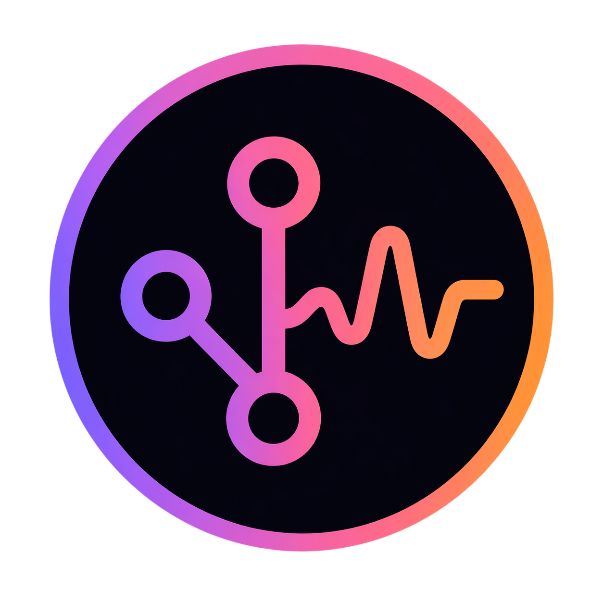
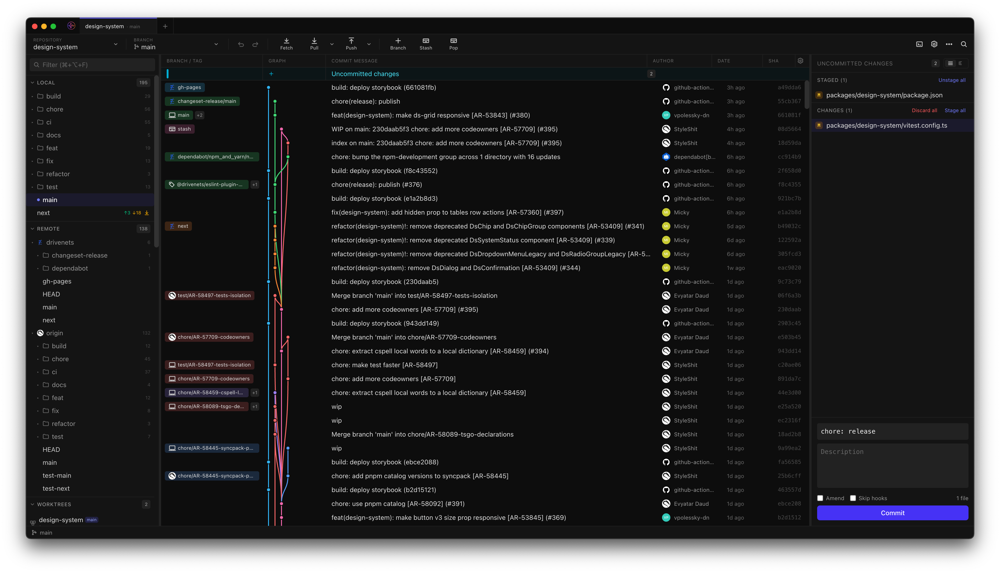
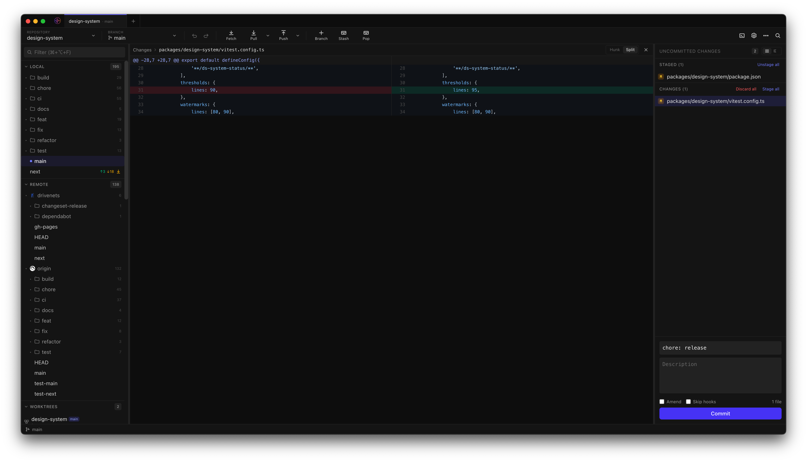
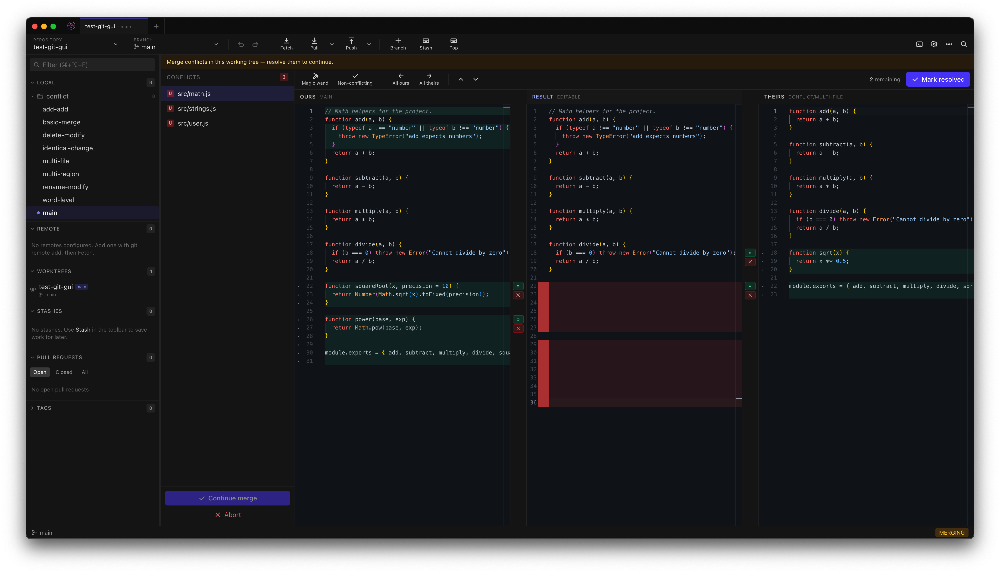

<div align="center">
  

  # Git Vibed
</div>

An experimental, 100% vibe-coded Git GUI built with Electron and React. Handles day-to-day Git work — staging, commits, branch management, and conflict resolution — in a fast, keyboard-friendly interface.



## Features

- **Commit graph** — DAG visualization with branch lanes, commit detail, and context menus for cherry-pick, revert, reset, and tag creation
- **Staging** — file-level, hunk-level, and line-level staging with a side-by-side Monaco diff viewer

  

- **Three-pane merge editor** — per-line accept/reject conflict resolution with syntax highlighting; auto-resolves non-conflicting lines

  
- **Branch management** — create, rename, delete, merge, rebase, push/pull, and open PRs from the branch list or graph
- **Stash management** — list, apply, drop, and inspect stash contents
- **GitHub integration** — PR list with CI status, open PR from branch context menu
- **Multi-repo tabs** — open several repositories side-by-side; tabs are locked while conflicts remain unresolved
- **Auto-refresh** — chokidar watches `.git` for changes and refreshes state in the background

## Tech stack

| Layer | Library |
|---|---|
| Shell | Electron 41 |
| UI | React 19 + TypeScript |
| Build | Vite + electron-builder |
| Styling | Tailwind CSS 4 |
| State | Zustand |
| Git | simple-git (wraps system `git`) |
| Merge | node-diff3 |
| Editor | Monaco Editor |

## Requirements

- Node.js ≥ 20
- pnpm
- System `git`

## Getting started

```sh
pnpm install
pnpm dev        # starts Vite dev server + Electron
```

## Build

```sh
pnpm build           # produces a distributable in dist/
pnpm build:unpack    # builds without packaging (faster for testing)
pnpm typecheck       # type-check renderer + main process
```

Targets: macOS (`.dmg`), Windows (NSIS installer), Linux (AppImage + `.deb`).
