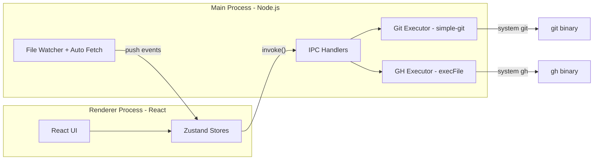

# Git GUI Client — Full Build Plan

## Stack

- **Electron** (latest) + **React 19** + **TypeScript** + **Vite**
- **simple-git** — wraps system `git` CLI for all git operations
- **node-diff3** — three-way merge engine (line-level + word-level for magic wand resolution)
- **@monaco-editor/react** — diff viewer, merge editor, commit message editor
- **diff2html** — read-only diff rendering in commit history views
- **zustand** — state management
- **Tailwind CSS 4** — styling with dark mode support
- **chokidar** — file system watcher for `.git` directory changes

## Architecture



## Project Structure

```
git-gui/
  package.json
  vite.config.ts
  electron-builder.json
  tailwind.config.ts
  tsconfig.json
  src-electron/
    main.ts                  # Electron main process, window management
    preload.ts               # contextBridge exposing typed gitApi + ghApi
    git/
      executor.ts            # Wraps simple-git; all git operations as async functions
      watcher.ts             # chokidar on .git dir + setInterval background fetch
      parser.ts              # Parse git log output into DAG for branch graph
    github/
      executor.ts            # Wraps gh CLI via execFile; --json output parsing
    ipc/
      git-handlers.ts        # ipcMain.handle for all git:* channels
      gh-handlers.ts         # ipcMain.handle for all gh:* channels
  src/
    main.tsx                 # React entry point
    App.tsx                  # Root layout, repo context provider
    types/
      git.ts                 # Commit, Branch, Remote, DiffHunk, ConflictRegion, etc.
      github.ts              # PR, Issue, Check, Review types
    stores/
      repo.ts                # Current repo state: branches, status, head, remotes
      settings.ts            # App preferences: theme, fetch interval, defaults
    lib/
      merge-engine.ts        # node-diff3 wrapper: diff3Merge + magic wand (word-level)
      patch-builder.ts       # Build custom patches for line-level staging
      graph-layout.ts        # DAG lane assignment algorithm for branch graph
      pr-url.ts              # Fallback: build create-PR URL for non-GitHub hosts
    components/
      layout/
        Sidebar.tsx          # Branch list, remotes, tags, PR list
        MainPanel.tsx        # Tabbed content area
        StatusBar.tsx        # Current branch, ahead/behind, CI status, fetch indicator
        Toolbar.tsx          # Pull, push, fetch buttons + dropdowns
      commit/
        CommitPanel.tsx      # Message textarea, amend checkbox, skip hooks checkbox
        StagingArea.tsx      # Unstaged/staged file lists with stage/unstage actions
        HunkSelector.tsx     # Hunk-level staging with diff view
        LineSelector.tsx     # Line-level staging via Monaco gutter checkboxes
      branches/
        BranchList.tsx       # Local + remote branches, context menu
        BranchActions.tsx    # Create, rename, delete, checkout dialogs
        MergeRebaseDialog.tsx
      graph/
        BranchGraph.tsx      # SVG commit graph with colored lanes
        CommitNode.tsx       # Single commit circle + decorations
        CommitDetail.tsx     # Selected commit metadata + file diff list
      merge/
        MergeEditor.tsx      # Three-pane Monaco (ours | result | theirs)
        MergeToolbar.tsx     # Apply non-conflicting, magic wand, prev/next conflict
        ConflictList.tsx     # List of conflicted files with resolution status
      remotes/
        RemoteList.tsx       # Table of remotes with add/edit/remove
        PushPullPanel.tsx    # Push/pull options (rebase, ff-only, force, etc.)
      github/
        PRList.tsx           # Open PRs sidebar section
        PRDetail.tsx         # PR body, files, reviews, checks, merge button
        PRCreateDialog.tsx   # Title, body, base/head, draft, reviewers
        CIStatus.tsx         # Green/red/yellow dots for checks
      settings/
        GitConfigPanel.tsx   # user.name, user.email, core.* with scope selector
        AppSettings.tsx      # Theme, fetch interval, default behaviors
```

## IPC Channels

All git/gh operations run in the main process. Renderer calls via `window.gitApi.*` / `window.ghApi.*` exposed through contextBridge.

**Git channels:**

- `git:status` — working tree status (staged, unstaged, untracked files)
- `git:commit` — params: `{ message, amend, noVerify }` — runs `git commit`
- `git:stage` — params: `{ files[] }` or `{ patch: string }` (for line/hunk level)
- `git:unstage` — params: `{ files[] }` or `{ patch: string }`
- `git:discard` — params: `{ files[] }` — `git checkout -- {file}`
- `git:pull` — params: `{ remote, branch, strategy: 'merge'|'rebase'|'ff-only' }`
- `git:push` — params: `{ remote, branch, force, setUpstream }`
- `git:fetch` — params: `{ remote }` or `--all --prune`
- `git:log` — params: `{ branch, limit, all }` — returns parsed commits with parent refs
- `git:diff` — params: `{ file, staged, commitA?, commitB? }` — returns diff text
- `git:branches` — returns local + remote branch list with tracking info
- `git:branch-create` / `git:branch-delete` / `git:branch-rename`
- `git:checkout` — params: `{ branch }`
- `git:merge` — params: `{ branch }` — returns conflict list on failure
- `git:rebase` — params: `{ onto }` — returns conflict list on failure
- `git:rebase-continue` / `git:rebase-abort` / `git:rebase-skip`
- `git:remotes` — CRUD operations on remotes
- `git:config-get` / `git:config-set` — params: `{ key, value, scope }`
- `git:file-at-ref` — params: `{ ref, path }` — returns file content (for merge base/ours/theirs)

**GitHub channels:**

- `gh:available` — check `gh auth status`, returns boolean
- `gh:pr-list` — `gh pr list --json number,title,state,author,url,headRefName,reviewDecision`
- `gh:pr-view` — `gh pr view N --json ...` (full detail)
- `gh:pr-create` — params: `{ base, head, title, body, draft, reviewers[] }`
- `gh:pr-merge` — params: `{ number, method: 'squash'|'merge'|'rebase' }`
- `gh:pr-checks` — `gh pr checks N --json name,status,conclusion`
- `gh:pr-review` — params: `{ number, action: 'approve'|'comment'|'request-changes', body }`
- `gh:repo-info` — `gh repo view --json name,owner,defaultBranchRef`

**Events (main -> renderer):**

- `repo:changed` — fired by chokidar watcher when `.git` dir changes
- `fetch:complete` — fired after background fetch with ahead/behind counts

## Feature Implementation Details

### 1. Commits (with amend + skip hooks)

- CommitPanel has a multi-line textarea for the commit message
- First line has a 72-char visual guide (subtle background change past col 72)
- **Amend checkbox**: when toggled ON, fetch `git log -1 --format=%B` and populate the textarea with the previous commit message; on commit run `git commit --amend -m "..."`; when toggled OFF, clear the textarea back
- **Skip pre-commit hooks checkbox**: when checked, append `--no-verify` to the commit command; persisted per-repo in app settings
- Commit button disabled when: message is empty OR nothing is staged (unless amend)
- Show summary below: "N files, +X -Y lines"

### 2. Pull / Push / Fetch

- Toolbar buttons with dropdown arrows for options
- **Pull dropdown**: merge (default), rebase, ff-only
- **Push**: detect if upstream is set; if not, prompt "Set upstream to origin/{branch}?"; show ahead/behind count on the button itself; optional force-push with confirm dialog
- **Fetch**: `git fetch --all --prune`; show spinner during operation
- Parse git stderr progress lines (e.g., "Receiving objects: 45%") for progress indication
- Error toasts on failure with the git error message

### 3. Automatic Background Fetch

- `setInterval` in main process, default every 5 minutes (configurable in settings)
- Runs `git fetch --all --prune` silently
- After fetch, compare local tracking refs to detect new remote commits
- Send `fetch:complete` event with `{ behind: number }` to renderer
- StatusBar shows "N commits behind" indicator when behind > 0
- Pause auto-fetch during active merge/rebase (check for `.git/MERGE_HEAD` or `.git/rebase-merge/`)

### 4. "Open PR" Button

- If `gh` is available: open PRCreateDialog (in-app PR creation with title, body, base/head selectors, draft toggle, reviewer picker)
- If `gh` is NOT available: fallback to `shell.openExternal()` with constructed URL:
  - Parse `git remote get-url origin` to detect host (GitHub/GitLab/Bitbucket)
  - GitHub: `https://github.com/{owner}/{repo}/compare/{base}...{branch}?expand=1`
  - GitLab: `https://gitlab.com/{owner}/{repo}/-/merge_requests/new?merge_request[source_branch]={branch}`
  - Bitbucket: `https://bitbucket.org/{owner}/{repo}/pull-requests/new?source={branch}`
- Base branch defaults to repo's default branch (from `gh repo view --json defaultBranchRef` or fallback to main/master)

### 5. Branch Management

- **BranchList** in sidebar: grouped by local / remote, with search/filter
- **Create**: dialog with name input + base branch dropdown; `git checkout -b {name} {base}`
- **Delete**: confirm dialog; `git branch -d`; warn if unmerged and offer force delete `-D`
- **Rename**: inline rename in list; `git branch -m {old} {new}`
- **Checkout**: click branch; warn if working tree is dirty (offer stash)
- **Merge**: select source branch -> `git merge {branch}`; on conflict, switch to merge editor
- **Rebase**: select onto branch -> `git rebase {onto}`; on conflict show conflict UI with continue/abort/skip buttons
- Right-click context menu on all branches for all actions

### 6. Branch Graph (Colored Lanes)

- Fetch data: `git log --all --oneline --parents --decorate --format="%H|%P|%an|%ae|%at|%s|%D"`
- **Parse** into a DAG: each commit node has `{ hash, parents[], author, timestamp, message, refs[] }`
- **Lane assignment algorithm** (in `graph-layout.ts`):
  - Process commits in topological order
  - Each branch gets a color (hash branch name to pick from a fixed palette of ~12 distinct colors)
  - Track active lanes as an array; first commit of a branch opens a lane, merge commits connect lanes with curves
  - Assign each commit an `(x: lane_index, y: row_index)` position
- **Render** with SVG inside a virtualized container (react-window for vertical virtualization):
  - Vertical colored lines for active lanes
  - Circles at commit positions
  - Bezier curves connecting child commits to parent commits across lanes (merge visualization)
  - Branch/tag ref labels as colored badges next to commit nodes
- **Interactions**: click commit to show CommitDetail (metadata + diff); hover for tooltip (full message, hash); right-click for cherry-pick, revert, checkout, reset actions
- **Performance**: virtualize rows; only render SVG paths for visible viewport + small buffer; cache layout computation

### 7. Git Settings Panel

- Read all config: `git config --list --show-origin`, parse into `{ file, key, value }` tuples
- Display grouped by section (user, core, remote, branch, etc.)
- Editable fields for common settings: `user.name`, `user.email`, `core.autocrlf`, `core.editor`, `pull.rebase`, `merge.conflictstyle`
- **Scope selector** per setting: Local (repo) vs Global; shows which file each value comes from
- Save: `git config --{scope} {key} {value}`

### 8. Staging Management

- **File-level**: two lists (unstaged / staged); click `+` to stage, `-` to unstage; "Stage All" / "Unstage All" buttons; file status icons (M/A/D/R/U)
- **Hunk-level**: click a file to expand its diff; each hunk has a stage/unstage button; implementation: build a patch containing only that hunk, apply via `git apply --cached` (stage) or `git apply --cached --reverse` (unstage)
- **Line-level**: Monaco editor showing the file diff; gutter checkboxes per line; user selects specific lines; build a custom patch from selected lines only (in `patch-builder.ts`) and apply via `git apply --cached`
- **Discard changes**: per-file `git checkout -- {file}` with confirm dialog; per-hunk discard by applying reverse patch to working tree
- Show diff stats per file in the list: `+X -Y`

### 9. Git Remotes Management

- **RemoteList**: table showing name, fetch URL, push URL (from `git remote -v`)
- **Add**: dialog with name + URL inputs; `git remote add {name} {url}`
- **Edit URL**: inline edit; `git remote set-url {name} {url}`
- **Set separate push URL**: `git remote set-url --push {name} {url}`
- **Remove**: confirm dialog; `git remote remove {name}`

### 10. Merge / Conflict Resolution

When a merge or rebase produces conflicts:

1. Show ConflictList with all conflicted files and their resolution state
2. Click a file to open MergeEditor (three-pane Monaco):

- **Left pane**: ours version (readonly)
- **Center pane**: result (editable, starts with base content)
- **Right pane**: theirs version (readonly)
- Scroll sync across all three panes via `onDidScrollChange`
- Line alignment using Monaco `IViewZone` spacers so corresponding regions line up
- Gutter decorations with `<<` (accept left) and `>>` (accept right) chevron buttons per hunk
- Color-coded backgrounds: green for ours changes, blue for theirs, red/orange for conflicts

1. **MergeToolbar buttons**:

- **"Apply Non-Conflicting"**: run `diff3Merge(ours, base, theirs)` from node-diff3; apply all `ok` regions to result pane; leave `conflict` regions highlighted
- **"Magic Wand" (Resolve Simple Conflicts)**: second pass over remaining conflicts:
  - If only one side changed from base -> take that side
  - If both sides made identical change -> take either
  - If single-line conflict: tokenize the line into words, run `diff3Merge` at word level; if no word-level conflicts, auto-resolve
- **"Previous Conflict" / "Next Conflict"**: navigate between unresolved conflict regions
- **"Accept All Left" / "Accept All Right"**: bulk actions

1. After resolving all conflicts in a file: "Mark Resolved" button -> `git add {file}`
2. After all files resolved: "Continue Merge" / "Continue Rebase" button

Implementation of magic wand word-level merge (in `merge-engine.ts`):

```typescript
import { diff3Merge } from "node-diff3";

function tryWordLevelMerge(
  baseLine: string,
  oursLine: string,
  theirsLine: string
): string | null {
  const tokenize = (s: string) => s.match(/\S+|\s+/g) || [];
  const result = diff3Merge(
    tokenize(oursLine),
    tokenize(baseLine),
    tokenize(theirsLine),
    {
      excludeFalseConflicts: true,
    }
  );
  if (result.some((r) => "conflict" in r)) return null;
  return result.flatMap((r) => r.ok).join("");
}
```

### 11. GitHub Integration (via `gh` CLI)

- **Detection**: on repo open, run `gh auth status`; if fails, hide all GitHub features and show subtle banner "Install/auth gh CLI for GitHub features"
- **PR list**: sidebar section below branches showing open PRs; columns: `#number title (author) [CI status]`
- **PR detail view**: shows body (rendered markdown), changed files (reuse diff viewer), review comments, CI checks list; action buttons: Approve, Request Changes, Merge (dropdown: squash/merge/rebase)
- **PR creation**: in-app dialog with: title input, body (markdown textarea), base branch selector, head branch (current), draft toggle, reviewer multi-select (from `gh api /repos/{o}/{r}/collaborators`); submits via `gh pr create`
- **CI status dots**: colored indicators next to branch names in branch list and in status bar; green = all passed, red = failed, yellow = pending
- **Refresh**: poll PR data on repo focus or manual refresh; not on interval

### 12. App Shell

- **Repo opening**: File > Open Folder, drag-and-drop, or command-line arg; validate `.git` exists; store recent repos list in electron-store
- **Window title**: `{repo_folder_name} - {current_branch}`
- **Theme**: dark mode (default) + light mode; follow system preference; toggle in settings
- **Keyboard shortcuts**:
  - `Ctrl/Cmd+Enter` — commit
  - `Ctrl/Cmd+Shift+P` — push
  - `Ctrl/Cmd+Shift+L` — pull
  - `Ctrl/Cmd+Shift+F` — fetch
  - `Ctrl/Cmd+K` — command palette (optional, later)
- **Error handling**: all git/gh operations wrapped in try/catch; errors shown as toast notifications with the stderr message; operations show loading spinners and disable conflicting buttons during execution
